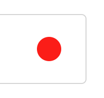
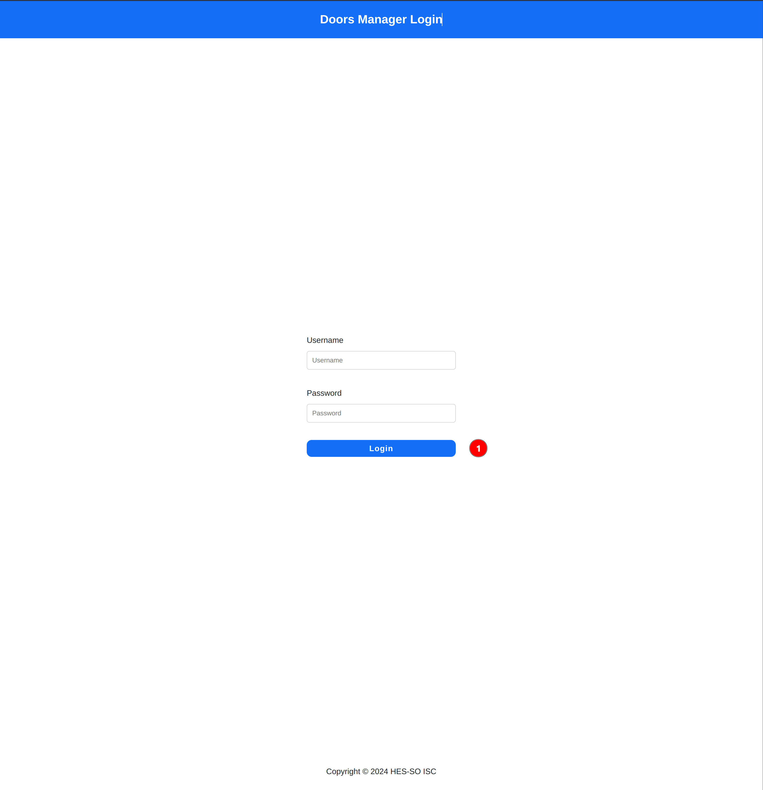
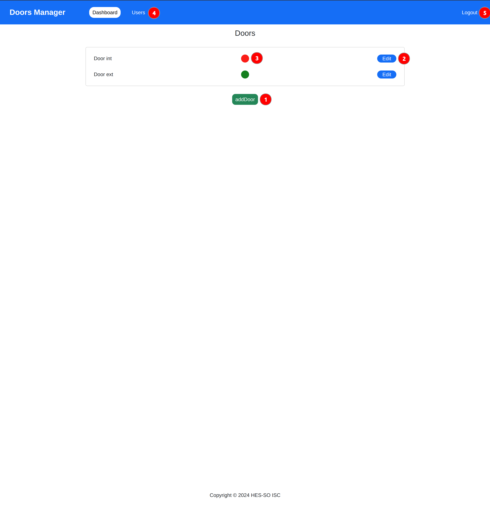
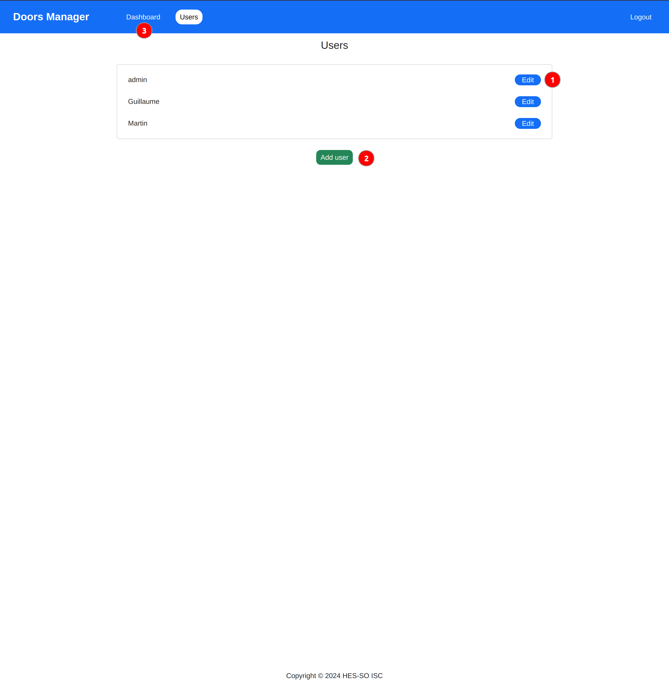
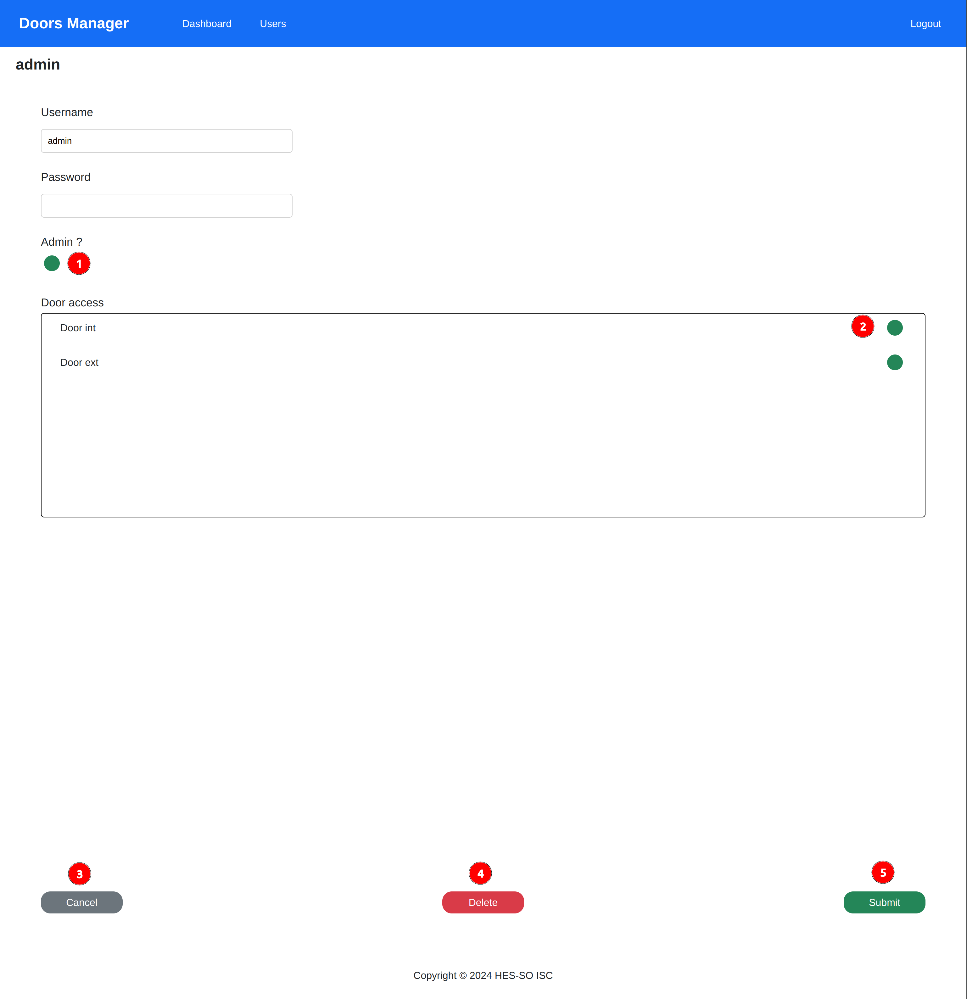
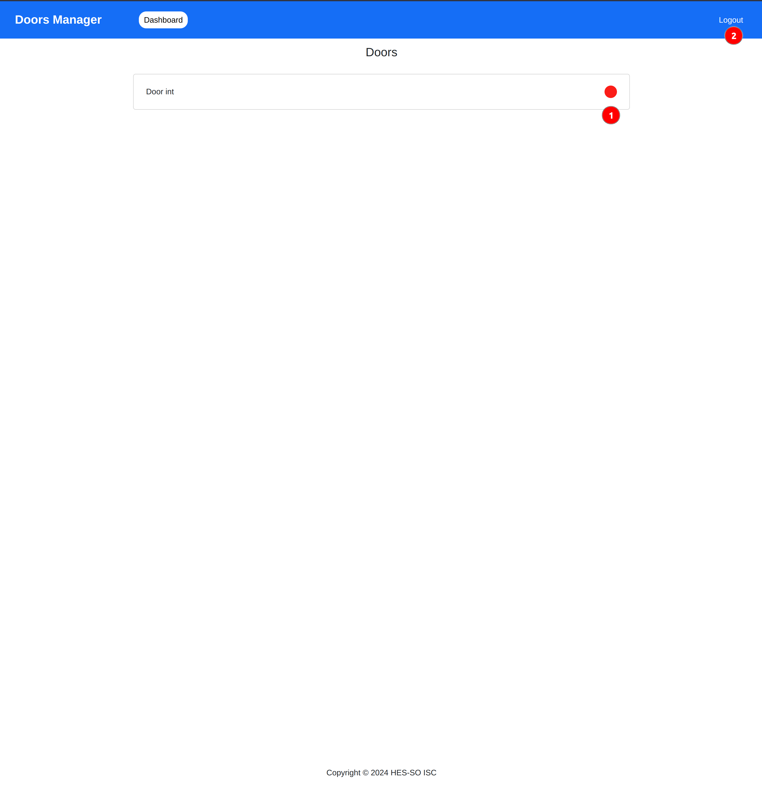

# User guide <!-- omit in toc -->

This user guide is splitted into two parts : Admin and normal user

## Table of content <!-- omit in toc -->

- [Admin](#admin)
  - [Dashboard](#dashboard)
  - [Door form](#door-form)
  - [User management](#user-management)
  - [User form](#user-form)
- [Normal User](#normal-user)
  - [User dashboard](#user-dashboard)

## Common knowledge

There is some feature that you will come across at multiple place in our application.

### Circle

This little circle is used in two ways in our app. It either tells :

- Red : Door closed / Doesn't have access
- Green : Door opened / Has access

You can toggle it status by clicking on it

## Homepage

When you first land on the application, you will land to a login page looking like this :

By clicking on one, you will either land in the admin interface (if you are an admin), or in the normal user interface.

# Admin

## Dashboard

By clicking on 1 or 2, you will land on the [door form](#door-form)

The red/green circle next to the 3 number is an indicator to wether a door is opened or closed. By clicking on it, you will toggle the state of the door.

By clicking on 4, you will land on the [User management](#user-management) page

By clicking on 5, you will logout and land back on the [homepage](#homepage)

## Door form

This page is a classic form, except for the access list. This list contains all the users. The circle next to the 1 tells us if the user has access to this door. By clicking on it, you can toggle the user access to the door.

By clicking on 2, you will cancel the modifications you have done on this page and go back to the [dashboard](#dashboard)

By clicking on 3, you will delete the door if you were in edition. Or cancel the creation if you were adding a new door

By clicking on 4, you will submit your modifications and go back to the [dashboard](#dashboard)

## User management

This page show you all the users registered in your application

By clicking on the 1, you will edit the selected user in the [user form](#user-form)

By clicking on the 2, you will create a new user in the [user form](#user-form)

By clicking on the 3, you will go back to the [dashboard](#dashboard)

## User form

This page allow you to edit/create a user. It contains a classic form except for three parts.

In order to change the password of a user, you can fill the password field. If you don't want to change it, you can leave it blank

The circle next to the 1 indicate wether or not this user is and admin, by clicking on it, you can toggle it.

The door access list contains all the doors in the system, it show by the circle next to the 2 wether this user can access this door or not. By clicking on it, you can toggle the user access to the door

# Normal User

This section show the page you will see by being a normal user

## User dashboard

On this dasboard, there is two things you can do :

By clicking on the 1, you can toggle the open/closed status of a door

By clicking on the 2, you can logout and go back to the [homepage](#homepage)